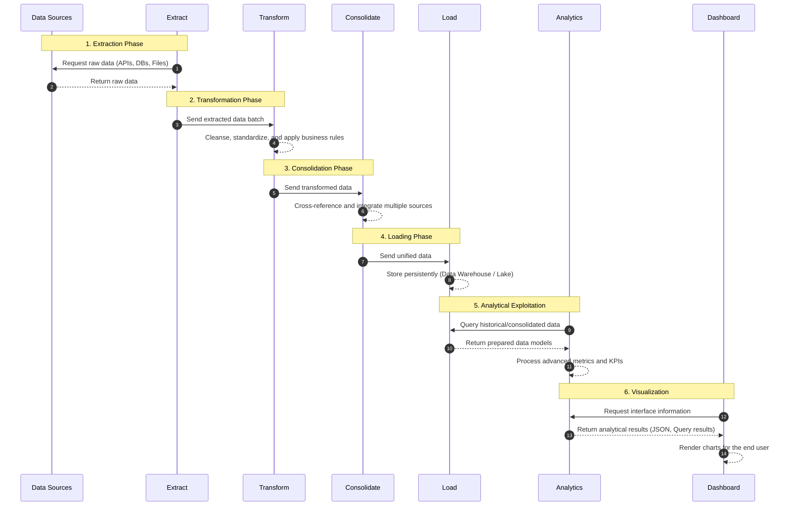

# Architecture

## Overview

Unified Data Insights Platform is a modular data integration and analytics platform designed to consolidate information from multiple operational systems into a unified analytical environment.

The platform follows a layered ETL architecture (Extract, Transform, Consolidate, Load) complemented by Analytics and Dashboard layers. Its primary goal is to transform fragmented datasets into reliable, actionable information for reporting, business intelligence, and decision-making.

The architecture is intentionally source-agnostic, allowing organizations to integrate new data providers without modifying the core system.

---

# Architectural Principles

The platform is built around the following principles:

* **Modularity**: each data source is isolated through independent extractors.
* **Scalability**: new sources can be added with minimal impact.
* **Maintainability**: clear separation of responsibilities across layers.
* **Data Quality**: validation, cleansing, and standardization are performed before consolidation.
* **Traceability**: data lineage is preserved throughout the pipeline.
* **Automation First**: minimize manual intervention wherever possible.
* **Analytics Ready**: outputs are optimized for reporting and dashboard consumption.

---

# High-Level Architecture

```text
DATA SOURCES
      │
      ▼
+-------------+
|   EXTRACT   |
+-------------+
      │
      ▼
+-------------+
| TRANSFORM   |
+-------------+
      │
      ▼
+-------------+
| CONSOLIDATE |
+-------------+
      │
      ▼
+-------------+
|    LOAD     |
+-------------+
      │
      ▼
+-------------+
| ANALYTICS   |
+-------------+
      │
      ▼
+-------------+
| DASHBOARD   |
+-------------+
```

---

# Data Flow


      

The pipeline operates sequentially, ensuring that raw data progresses through validation, cleansing, consolidation, storage, and analytical processing before reaching end users.

---

# Architecture Layers

## 1. Extract Layer

### Purpose

Responsible for collecting data from external systems and validating source files before processing.

### Responsibilities

* Read source files.
* Validate file existence.
* Validate schema structure.
* Detect format errors.
* Generate standardized raw datasets.

### Design

Each source implements an independent extractor.

Examples:

```text
extract/
├── customer_extractor.py
├── events_extractor.py
├── chatbot_extractor.py
├── attendance_extractor.py
└── surveys_extractor.py
```

### Output

Standardized raw DataFrames.

---

## 2. Transform Layer

### Purpose

Standardize and clean extracted data.

### Responsibilities

* Normalize column names.
* Standardize data types.
* Clean invalid records.
* Standardize date formats.
* Normalize email addresses.
* Remove duplicates.
* Handle missing values.

### Typical Operations

```text
Raw Data
    │
    ├── Column normalization
    ├── Date standardization
    ├── Text cleaning
    ├── Email normalization
    └── Validation rules
```

### Output

Clean, validated, source-specific datasets.

---

## 3. Consolidate Layer

### Purpose

Merge multiple datasets into a unified master dataset.

### Responsibilities

* Identify unique entities.
* Match records across systems.
* Resolve duplicates.
* Create consolidated profiles.
* Generate relationship mappings.

### Matching Strategy

#### High Confidence Match

```text
email
```

#### Secondary Match

```text
first_name + last_name
```

Secondary matches should be flagged as lower-confidence relationships for review.

### Output

Master dataset containing unified records.

---

## 4. Load Layer

### Purpose

Persist processed data into analytical storage.

### Responsibilities

* Generate consolidated datasets.
* Maintain analytical tables.
* Store processed records.
* Support historical tracking.

### Storage Components

```text
storage/
├── consolidated/
├── analytics/
└── database/
```

### Current Database

SQLite is used as the primary storage engine.

### Output

Structured analytical database.

---

## 5. Analytics Layer

### Purpose

Transform consolidated data into business metrics and insights.

### Responsibilities

* KPI generation.
* Segmentation analysis.
* Participation metrics.
* Trend calculations.
* Statistical summaries.
* Data preparation for visualization.

### Examples

* User participation rates.
* Conversion funnels.
* Regional analysis.
* Activity trends.
* Source adoption metrics.

### Output

```text
JSON
DataFrames
Aggregated Tables
```

---

## 6. Dashboard Layer

### Purpose

Provide interactive visualization and reporting capabilities.

### Responsibilities

* KPI visualization.
* Filtering.
* Dynamic reports.
* Interactive charts.
* Data exploration.

### Technologies

* Streamlit
* Plotly

### Output

Interactive analytical dashboards.

---

# Conceptual Data Model

The platform revolves around a consolidated master entity.

## Master Entity

```text
master_entity
```

### Core Attributes

| Field                  | Description                      |
| ---------------------- | -------------------------------- |
| entity_id              | Internal unique identifier       |
| email                  | Primary matching field           |
| first_name             | First name                       |
| last_name              | Last name                        |
| region                 | Geographic region                |
| city                   | Geographic city                  |
| category               | Business-specific classification |
| first_interaction_date | Earliest known interaction       |
| last_interaction_date  | Most recent interaction          |

### Behavioral Indicators

| Field              | Description                 |
| ------------------ | --------------------------- |
| has_registration   | Registered in source system |
| attended_event     | Participated in event       |
| used_service       | Interacted with service     |
| completed_activity | Completed tracked activity  |

---

# Technology Stack

| Component            | Technology |
| -------------------- | ---------- |
| Programming Language | Python     |
| Data Processing      | Pandas     |
| Database             | SQLite     |
| Dashboard            | Streamlit  |
| Visualization        | Plotly     |
| Scheduling           | Schedule   |
| Version Control      | Git        |
| Repository Hosting   | GitHub     |

---

# Project Structure

```text
unified-data-insights-platform/
│
├── data/
│   ├── raw/
│   ├── processed/
│   └── analytics/
│
├── extract/
├── transform/
├── consolidate/
├── load/
├── analytics/
├── dashboard/
│
├── database/
│
├── tests/
│
├── docs/
│   └── architecture.md
│
├── config/
│
└── main.py
```

---

# Scalability Strategy

The architecture is designed to support future integrations without requiring changes to the core pipeline.

Potential future sources include:

* CRM systems
* Survey platforms
* External APIs
* Learning platforms
* Ticketing systems
* Event management tools
* Customer support platforms

To integrate a new source, only a dedicated extractor and source-specific transformation logic must be implemented.

---

# Data Lifecycle

```text
Source Data
      │
      ▼
Extraction
      │
      ▼
Validation
      │
      ▼
Transformation
      │
      ▼
Consolidation
      │
      ▼
Storage
      │
      ▼
Analytics
      │
      ▼
Visualization
```

---

# Expected Benefits

## Operational

* Reduced manual effort.
* Lower risk of data-entry errors.
* Improved process consistency.
* Better traceability.

## Analytical

* Unified records.
* Reliable KPIs.
* Faster reporting.
* Improved decision support.

## Strategic

* Foundation for advanced analytics.
* Easier automation initiatives.
* Future-ready data ecosystem.
* Scalable architecture for organizational growth.

---

# Future Evolution

Planned enhancements may include:

* Automated scheduling pipelines.
* API-based ingestion.
* Incremental data loading.
* Data quality monitoring.
* Machine learning integration.
* Predictive analytics.
* Data warehouse migration.
* Cloud-native deployment.

---

# Architecture Summary

Unified Data Insights Platform provides a scalable and maintainable framework for consolidating disparate datasets into a centralized analytical environment. Through its modular ETL architecture and analytics-driven design, the platform enables organizations to reduce manual processing, improve data quality, and generate actionable insights from multiple operational systems.
