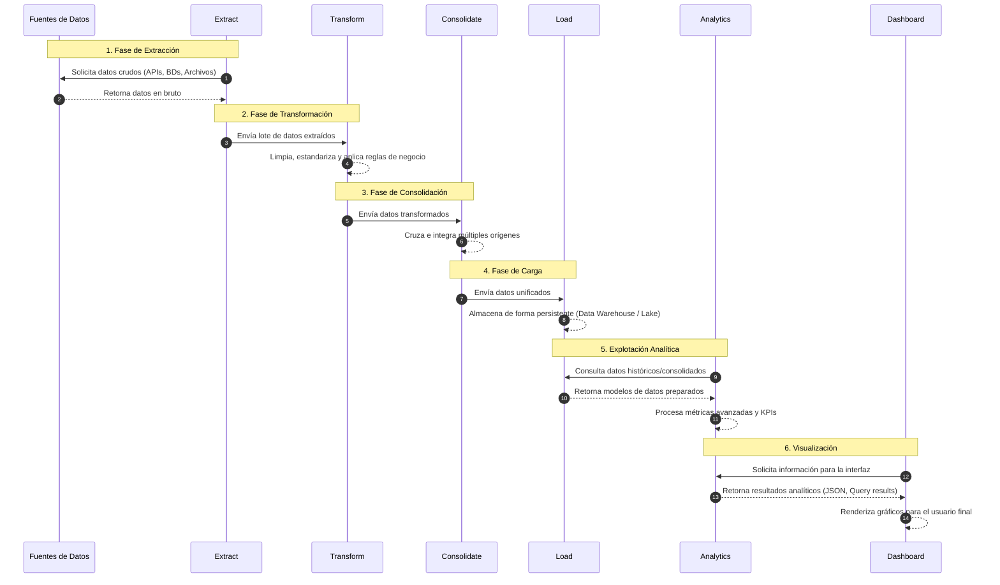

# Arquitectura

## Descripción General

Unified Data Insights Platform es una plataforma modular de integración y análisis de datos diseñada para consolidar información proveniente de múltiples sistemas operativos en un entorno analítico unificado.

La plataforma sigue una arquitectura ETL por capas (Extracción, Transformación, Consolidación y Carga), complementada por capas de Analítica y Visualización. Su objetivo principal es transformar conjuntos de datos dispersos en información confiable y accionable para procesos de reporting, inteligencia de negocios y toma de decisiones.

La arquitectura ha sido diseñada para ser independiente de la organización o industria, permitiendo incorporar nuevas fuentes de datos sin modificar el núcleo del sistema.

---

# Principios Arquitectónicos

La plataforma se construye sobre los siguientes principios:

* **Modularidad:** cada fuente de datos se integra mediante componentes independientes.
* **Escalabilidad:** nuevas fuentes pueden agregarse con mínimo impacto.
* **Mantenibilidad:** clara separación de responsabilidades entre capas.
* **Calidad de Datos:** validación y limpieza antes de la consolidación.
* **Trazabilidad:** seguimiento completo del ciclo de vida de los datos.
* **Automatización:** reducción de procesos manuales repetitivos.
* **Orientación Analítica:** datos preparados para métricas y visualización.

---

# Arquitectura General

```text
FUENTES DE DATOS
        │
        ▼
+---------------+
|   EXTRACT     |
+---------------+
        │
        ▼
+---------------+
|  TRANSFORM    |
+---------------+
        │
        ▼
+---------------+
| CONSOLIDATE   |
+---------------+
        │
        ▼
+---------------+
|     LOAD      |
+---------------+
        │
        ▼
+---------------+
|  ANALYTICS    |
+---------------+
        │
        ▼
+---------------+
|  DASHBOARD    |
+---------------+
```

---

# Flujo de Datos



El flujo opera de forma secuencial, garantizando que los datos sean validados, limpiados, consolidados y almacenados antes de ser utilizados para análisis y visualización.

---

# Capas de la Arquitectura

## 1. Capa Extract

### Objetivo

Obtener datos desde sistemas externos y validar su estructura antes de iniciar el procesamiento.

### Responsabilidades

* Leer archivos de origen.
* Validar existencia de archivos.
* Verificar estructura y esquema.
* Detectar errores de formato.
* Generar conjuntos de datos estandarizados.

### Diseño

Cada fuente de datos implementa un extractor independiente.

Ejemplo:

```text
extract/
├── customer_extractor.py
├── events_extractor.py
├── chatbot_extractor.py
├── attendance_extractor.py
└── surveys_extractor.py
```

### Salida

DataFrames estandarizados con datos crudos validados.

---

## 2. Capa Transform

### Objetivo

Normalizar y limpiar la información extraída.

### Responsabilidades

* Homologar nombres de columnas.
* Estandarizar tipos de datos.
* Limpiar registros inválidos.
* Normalizar fechas.
* Normalizar correos electrónicos.
* Eliminar duplicados.
* Gestionar valores faltantes.

### Operaciones Típicas

```text
Datos Crudos
      │
      ├── Normalización de columnas
      ├── Estandarización de fechas
      ├── Limpieza de texto
      ├── Normalización de correos
      └── Validación de reglas
```

### Salida

Conjuntos de datos limpios y preparados para consolidación.

---

## 3. Capa Consolidate

### Objetivo

Integrar múltiples fuentes en un conjunto maestro de datos.

### Responsabilidades

* Identificar entidades únicas.
* Relacionar registros entre sistemas.
* Resolver duplicidades.
* Construir perfiles consolidados.
* Generar relaciones entre fuentes.

### Estrategia de Emparejamiento

#### Coincidencia de Alta Confianza

```text
email
```

#### Coincidencia Secundaria

```text
nombre + apellido
```

Las coincidencias secundarias deben marcarse como relaciones de menor confianza para facilitar futuras validaciones.

### Salida

Dataset maestro consolidado.

---

## 4. Capa Load

### Objetivo

Persistir los datos procesados en un repositorio analítico centralizado.

### Responsabilidades

* Generar datasets consolidados.
* Mantener tablas analíticas.
* Almacenar registros procesados.
* Preservar historial de datos.

### Componentes de Almacenamiento

```text
storage/
├── consolidated/
├── analytics/
└── database/
```

### Base de Datos Actual

SQLite es utilizado como motor principal de almacenamiento.

### Salida

Base de datos analítica estructurada.

---

## 5. Capa Analytics

### Objetivo

Transformar los datos consolidados en métricas e información de valor.

### Responsabilidades

* Generación de KPIs.
* Segmentación de usuarios.
* Cálculo de indicadores.
* Análisis de tendencias.
* Resúmenes estadísticos.
* Preparación de datos para visualización.

### Ejemplos de Métricas

* Tasas de participación.
* Embudos de conversión.
* Indicadores territoriales.
* Tendencias de actividad.
* Uso de servicios por canal.

### Salida

```text
JSON
DataFrames
Tablas Agregadas
```

---

## 6. Capa Dashboard

### Objetivo

Entregar una interfaz visual para explorar información y métricas.

### Responsabilidades

* Visualización de KPIs.
* Filtros dinámicos.
* Reportes interactivos.
* Gráficos analíticos.
* Exploración de datos.

### Tecnologías

* Streamlit
* Plotly

### Salida

Dashboards interactivos para usuarios finales.

---

# Modelo Conceptual de Datos

La plataforma se estructura en torno a una entidad maestra consolidada.

## Entidad Principal

```text
master_entity
```

### Atributos Base

| Campo                  | Descripción                      |
| ---------------------- | -------------------------------- |
| entity_id              | Identificador interno único      |
| email                  | Campo principal de consolidación |
| first_name             | Nombre                           |
| last_name              | Apellido                         |
| region                 | Región                           |
| city                   | Ciudad o comuna                  |
| category               | Clasificación de negocio         |
| first_interaction_date | Primera interacción registrada   |
| last_interaction_date  | Última interacción registrada    |

### Indicadores de Comportamiento

| Campo              | Descripción                   |
| ------------------ | ----------------------------- |
| has_registration   | Registro en plataforma        |
| attended_event     | Participó en evento           |
| used_service       | Utilizó algún servicio        |
| completed_activity | Completó actividad registrada |

---

# Tecnologías Utilizadas

| Componente               | Tecnología |
| ------------------------ | ---------- |
| Lenguaje de Programación | Python     |
| Procesamiento de Datos   | Pandas     |
| Base de Datos            | SQLite     |
| Dashboard                | Streamlit  |
| Visualización            | Plotly     |
| Automatización           | Schedule   |
| Control de Versiones     | Git        |
| Repositorio              | GitHub     |

---

# Estructura del Proyecto

```text
unified-data-insights-platform/
│
├── data/
│   ├── raw/
│   ├── processed/
│   └── analytics/
│
├── extract/
├── transform/
├── consolidate/
├── load/
├── analytics/
├── dashboard/
│
├── database/
│
├── tests/
│
├── docs/
│   └── architecture_ES.md
│
├── config/
│
└── main.py
```

---

# Estrategia de Escalabilidad

La arquitectura está diseñada para soportar nuevas integraciones sin modificar el flujo principal.

Posibles fuentes futuras:

* Sistemas CRM.
* Plataformas de encuestas.
* APIs externas.
* Plataformas de capacitación.
* Sistemas de tickets.
* Herramientas de gestión de eventos.
* Plataformas de atención al cliente.

La incorporación de una nueva fuente requiere únicamente:

1. Implementar un extractor específico.
2. Definir las reglas de transformación correspondientes.

---

# Ciclo de Vida de los Datos

```text
Datos de Origen
        │
        ▼
Extracción
        │
        ▼
Validación
        │
        ▼
Transformación
        │
        ▼
Consolidación
        │
        ▼
Almacenamiento
        │
        ▼
Analítica
        │
        ▼
Visualización
```

---

# Beneficios Esperados

## Operacionales

* Reducción de tareas manuales.
* Menor probabilidad de errores.
* Mayor consistencia de datos.
* Mejor trazabilidad.

## Analíticos

* Información consolidada.
* Indicadores confiables.
* Generación rápida de reportes.
* Mejor soporte para la toma de decisiones.

## Estratégicos

* Base para futuras automatizaciones.
* Soporte para proyectos de analítica avanzada.
* Ecosistema de datos escalable.
* Preparación para crecimiento organizacional.

---

# Evolución Futura

Posibles mejoras de la plataforma:

* Automatización completa de pipelines.
* Integración mediante APIs.
* Cargas incrementales.
* Monitoreo de calidad de datos.
* Incorporación de Machine Learning.
* Analítica predictiva.
* Migración a Data Warehouse.
* Despliegue en infraestructura cloud.

---

# Resumen de la Arquitectura

Unified Data Insights Platform proporciona una solución escalable y mantenible para consolidar información proveniente de múltiples sistemas en un entorno analítico centralizado. Su arquitectura modular basada en ETL permite mejorar la calidad de los datos, reducir procesos manuales y generar información estratégica para apoyar la toma de decisiones y futuras iniciativas de transformación digital.
